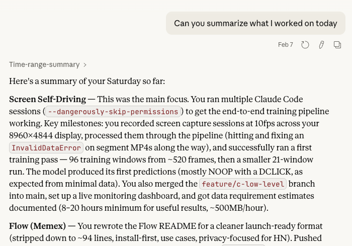

# Memex

Searchable screen history for your entire computer. Memex takes a screenshot every minute, extracts the text, and makes it all searchable using [ChromaDB](https://www.trychroma.com/).

> Inspired by Vannevar Bush's [Memex](https://en.wikipedia.org/wiki/Memex) — a vision for a device that organizes and retrieves all of a person's information. This project brings that idea to your desktop.

## Install

```bash
curl -fsSL https://raw.githubusercontent.com/joenewbry/memex/main/install.sh | sh
```

Then add to your PATH and start:

```bash
export PATH="$HOME/.local/bin:$PATH"  # add to ~/.zshrc or ~/.bashrc
memex start
```

**macOS:** Requires Tesseract (`brew install tesseract`) and Screen Recording permission for your terminal in System Settings > Privacy & Security.

## Use Cases

- **Meeting recall** — "What did we discuss in the standup this morning?"
- **Link recovery** — "Find the Hacker News post about Anthropic I was reading yesterday"
- **Work summaries** — "Summarize what I worked on this week" (try the `daily-summary` MCP tool for structured single-day reports)
- **Onboarding docs** — "Create documentation for the Centurion project based on my screen history from March"
- **Context switching** — "What was I doing before lunch? Help me pick up where I left off"
- **Debug archaeology** — "Find that error message I saw in the terminal two days ago"

### Example

> "Can you summarize what I worked on today"



## How It Works

1. **Capture** — screenshots every 60 seconds, all displays
2. **Extract** — Tesseract OCR pulls text from each screenshot
3. **Index** — ChromaDB stores text as vector embeddings
4. **Search** — semantic search via MCP tools or the CLI

Everything stays local on your machine.

## CLI

```bash
memex status          # health check
memex doctor          # full diagnostics
memex ask "query"     # AI-powered natural language search
memex chat            # interactive chat
memex search "query"  # direct text search
memex stats           # activity statistics
memex start / stop    # control the capture daemon
memex watch           # live view of captures
memex logs            # view service logs (mcp, capture)
memex auth login      # configure API keys (Anthropic/OpenAI)
```

## MCP Integration

Built for Claude Desktop, Cursor, or any MCP-compatible client.

### Claude Desktop

Add to `~/Library/Application Support/Claude/claude_desktop_config.json`:

```json
{
  "mcpServers": {
    "memex": {
      "command": "$HOME/.memex/.venv/bin/python",
      "args": ["-u", "$HOME/.memex/mcp-server/server.py"]
    }
  }
}
```

Replace `$HOME` with your full home directory path (e.g. `/Users/yourname`) and restart Claude Desktop.

### Claude.ai (Remote via Connector)

Access Memex from claude.ai on any computer by exposing the MCP HTTP server with ngrok.

Start Memex with the MCP server, then expose it:

```bash
memex start --mcp
ngrok http 8082
```

In Claude.ai, go to **Settings > Connectors** and add a new connector with the URL:

```
https://YOUR_NGROK_URL.ngrok-free.dev/sse
```

Replace `YOUR_NGROK_URL` with your actual ngrok URL. No bridge or extra tools required.

### Claude Desktop (Remote via NGROK)

Claude Desktop uses stdio-based MCP servers and can't connect to a URL directly. Use `mcp-remote` to bridge the gap:

```bash
memex start --mcp
ngrok http 8082
```

Add to `~/Library/Application Support/Claude/claude_desktop_config.json`:

```json
{
  "mcpServers": {
    "memex": {
      "command": "npx",
      "args": [
        "mcp-remote",
        "https://YOUR_NGROK_URL.ngrok-free.dev/sse"
      ]
    }
  }
}
```

Replace `YOUR_NGROK_URL` with your actual ngrok URL and restart Claude Desktop. Requires Node.js.

### Cursor

Start the HTTP server and expose via ngrok, then add to `~/.cursor/mcp.json`:

```json
{
  "mcpServers": {
    "memex": {
      "url": "https://YOUR_NGROK_URL.ngrok-free.dev/sse"
    }
  }
}
```

## Why I Made This

I realized I didn't have any real history of my work from the last few years. Even in the best of times, I only occasionally take notes and record what I worked on. With vector storage and MCP, it felt like there should be a better solution — one that doesn't require me to always take notes, and lets me extract useful information after the fact.

## Contributing

Open a PR and send me an email at joenewbry@gmail.com with a link to the PR and what the change is. I'll review it.

## License

MIT — see [LICENSE](LICENSE) for details.

## Support

- **Issues**: [GitHub Issues](https://github.com/joenewbry/memex/issues)
- **Email**: joenewbry@gmail.com
