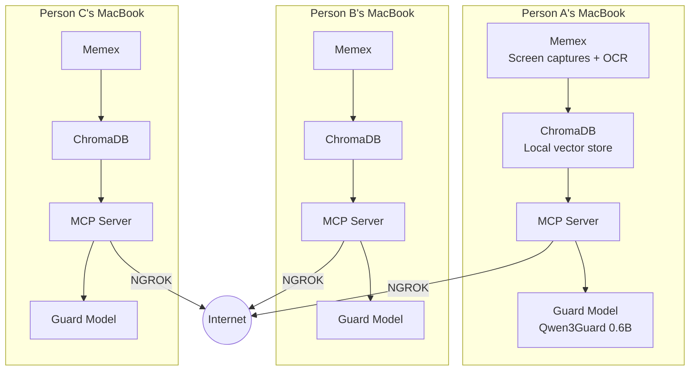
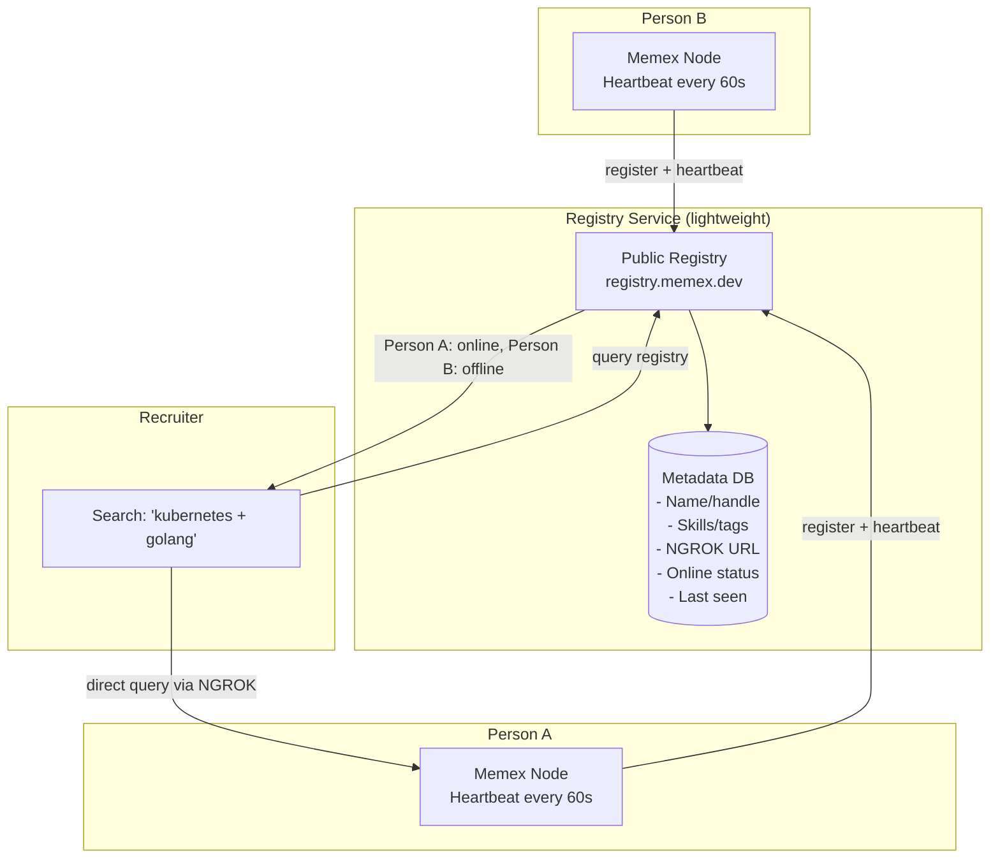
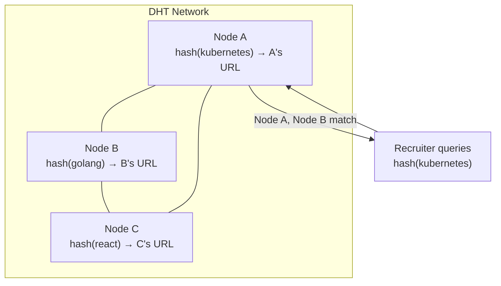
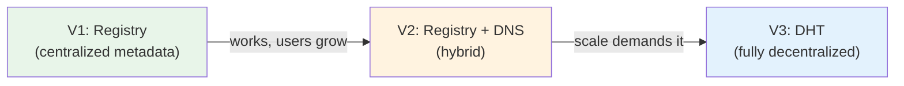
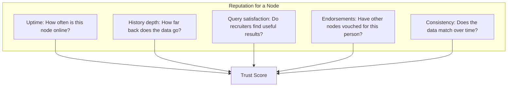

# Decentralized Memex Network

## The Vision

Every person runs Memex on their own computer. Their work history lives on their
machine — not on a company's server. When they want to share it (for job searching,
collaboration, reputation), they expose it through NGROK. The challenge is
connecting these individual nodes into something searchable.



## Why Decentralized?

**The resume is broken.** It's a static document that:
- The person curates (bias toward self-promotion)
- Gets outdated immediately
- Contains no proof of actual work
- Is the same for every job (one-size-fits-all)

**Memex replaces the resume** with a searchable, verifiable history of what
someone actually worked on. But this only works if:

1. **The person controls their data** — not LinkedIn, not a recruiter platform
2. **The data is authentic** — it comes from actual screen captures, not claims
3. **It's queryable** — someone can ask "show me Kubernetes work" and get results

A centralized platform that hosts everyone's Memex would recreate LinkedIn's
problems. A decentralized approach keeps power with individuals.

## The Discovery Problem

The hard part: how does a recruiter find people?

In a centralized system, you have a database of all users. In a decentralized
system, each person is an independent node. The recruiter needs a way to:

1. Know that these nodes exist
2. Know what topics each node covers (without searching all of them)
3. Connect to the right ones

### Approach 1: Registry with Metadata (Recommended Starting Point)

A lightweight central registry that stores only metadata — not the actual data.



**What the registry stores:**
- Handle/name (e.g., `@joenewbry`)
- Embedding centroid (auto-generated vector fingerprint of recent work)
- Derived topics (human-readable labels extracted from centroid, for display)
- Current NGROK URL (changes on restart)
- Online/offline status
- Last heartbeat timestamp
- History depth (how far back the Memex data goes)

**What the registry does NOT store:**
- Screen captures
- OCR text
- Search results
- Any actual Memex data

**How it works:**

1. Person runs `memex publish` — registers with the registry, sends heartbeat
2. Registry tracks who's online and their current NGROK URL
3. Recruiter searches the registry: "show me people who work with Kubernetes"
4. Registry returns a list of matching, online nodes
5. Recruiter queries each node directly through NGROK
6. The guard model on each node filters the request/response

```bash
# Person publishes their node (no tags needed — centroid is auto-computed)
memex publish --handle "@joenewbry"
# → Registered at registry.memex.dev
# → Centroid computed from 14 months of captures
# → Heartbeat running every 60s
# → Your NGROK URL: https://abc123.ngrok.app

# Recruiter searches (plain language, matched against centroids)
memex discover "kubernetes engineer with AWS experience"
# → Found 3 matching nodes (ranked by centroid similarity):
# → @joenewbry (score: 0.94) — online, 14mo history
# → @janedoe (score: 0.87) — online, 9mo history
# → @bobsmith (score: 0.71) — offline (last seen 2h ago), 6mo history

# Recruiter queries a specific node
memex query @joenewbry "what kubernetes projects have you worked on recently?"
# → Results from joenewbry's Memex (filtered by guard model)
```

**Pros:**
- Simple to build (a single FastAPI server + SQLite)
- Solves the discovery problem
- Person controls what tags they publish
- Actual data stays on the person's machine
- Registry can be open-source and self-hostable

**Cons:**
- Single point of failure (the registry)
- Requires trust in the registry operator
- NGROK URLs change on free tier (need heartbeat to update)

### Approach 2: DNS-Based Discovery (No Central Server)

Each person publishes a DNS TXT record with their Memex metadata.

```
_memex.joenewbry.dev TXT "ngrok=https://abc123.ngrok.app tags=kubernetes,golang"
```

A search tool crawls known domains or uses a curated list.

**Pros:** Truly decentralized, no registry server needed
**Cons:** Requires a domain name, DNS propagation is slow, hard to search

### Approach 3: DHT-Based Discovery (Like BitTorrent)

Use a distributed hash table where each node announces itself.



**Pros:** No central server, truly peer-to-peer
**Cons:** Complex to implement, NAT traversal issues, bootstrap problem

### Approach 4: ActivityPub / Fediverse (Social Discovery)

Each Memex node is an ActivityPub actor (like Mastodon). Nodes can follow each
other, share updates, and be discovered through the fediverse.

**Pros:** Existing ecosystem, social graph for discovery
**Cons:** Heavy protocol, not designed for search, complex implementation

## Recommended Path



**Start with Approach 1 (Registry).** It's the simplest, solves the problem,
and can be built in a weekend. As the network grows, layer in DNS-based
discovery as a fallback, and eventually move toward a DHT if the network
gets large enough to justify it.

## The NGROK Problem

Free-tier NGROK URLs change every time you restart the tunnel. This means:

- The registry needs frequent heartbeats to stay current
- If a person's laptop sleeps, their URL goes stale
- There's no stable address for a node

### Solutions

| Approach | Cost | Stability |
|----------|------|-----------|
| Free NGROK + heartbeat | Free | URL changes on restart |
| NGROK paid (custom domain) | $8/mo | Stable subdomain |
| Cloudflare Tunnel | Free | Stable, requires domain |
| Tailscale + public node | Free | Stable, requires relay |
| Self-hosted VPS + WireGuard | ~$5/mo | Fully stable |

**Recommendation:** Start with free NGROK + heartbeat. If someone wants a stable
presence, they can upgrade to NGROK paid ($8/mo) or use Cloudflare Tunnel with
their own domain.

## Trust and Reputation

In a decentralized network, trust is earned, not granted.

### Reputation Signals



These signals are observable without trusting any central authority:

- **Uptime** — the registry tracks heartbeats
- **History depth** — the node reports how far back its data goes
- **Query satisfaction** — recruiters can rate their experience
- **Endorsements** — other Memex users can vouch (like LinkedIn recommendations,
  but backed by actual work history)
- **Consistency** — the same queries return consistent results over time

### Anti-Gaming

What stops someone from faking their Memex data?

1. **Temporal consistency** — screenshots have timestamps. A real work history
   has natural patterns (9-5 activity, weekend gaps, context switches). Faked
   data tends to be too uniform.

2. **Cross-referencing** — if two people worked on the same project, their
   Memex data should overlap. "Show me who else was working on Project X"
   creates a verifiable web.

3. **Depth queries** — a recruiter can ask follow-up questions. Faked data
   breaks down under scrutiny because the underlying screenshots don't exist.

4. **Proof of work** — the sheer volume of data (one screenshot per minute,
   24/7) is impractical to fake. A year of Memex data is ~500K screenshots.

## Data Sovereignty

Each person owns their data:

- **Storage:** On their own machine, in their own ChromaDB
- **Access:** Controlled by their own guard model and security policy
- **Deletion:** `rm -rf ~/.memex` and it's gone — no trace on any server
- **Portability:** Export to JSON, move to another machine, keep working
- **Visibility:** They choose what tags to publish, when to go online/offline

The registry stores only what the person explicitly publishes (tags, handle,
URL). If they unregister, the registry forgets them immediately.

## Economic Model

### For Individuals (Node Operators)

- **Free:** Run Memex, capture your work, search locally
- **Free:** Publish to registry, share via NGROK (free tier)
- **$8/mo:** Stable NGROK URL for always-on presence
- **Optional:** Self-host on a $5/mo VPS for maximum reliability

### For Recruiters / Searchers

- **Phase 1 (now):** Free — just provide an email to query
- **Phase 2:** Freemium — 10 free queries/day, pay for more
- **Phase 3:** Subscription — $X/mo for unlimited queries across the network

### For the Network

- The registry is open-source and can be self-hosted
- The default registry (registry.memex.dev) could be funded by:
  - Recruiter subscriptions
  - Premium node features (analytics, uptime monitoring)
  - Donations / grants

## What to Build First

### Phase 1: Single Node (Current)
- [x] Memex captures and indexes screen history
- [x] MCP server exposes search tools
- [x] NGROK tunnel enables remote access
- [ ] Guard model filters requests and responses
- [ ] Audit log tracks all queries
- [ ] Email-based identity gate

### Phase 2: Registry
- [ ] Central registry service (FastAPI + SQLite)
- [ ] `memex publish` command
- [ ] Heartbeat daemon (updates NGROK URL)
- [ ] `memex discover` command for searching the registry
- [ ] `memex query @handle` command for querying a specific node
- [ ] Web UI for the registry (search people by skills)

### Phase 3: Network Effects
- [ ] Endorsement system (vouch for other nodes)
- [ ] Cross-node search ("find everyone who worked with Kubernetes")
- [ ] Reputation scoring
- [ ] Recruiter accounts with usage tracking

### Phase 4: Sustainability
- [ ] Paid tier for recruiters
- [ ] Premium node features
- [ ] Stable hosting options (Cloudflare Tunnel integration)
- [ ] Mobile companion app (view your audit log on the go)

## Technical Stack for the Registry

Keep it minimal:

```
Registry Service
├── FastAPI (HTTP API)
├── SQLite (metadata storage)
├── No auth framework — just email + optional tokens
├── Deployed on: Fly.io / Railway / any $5 VPS
└── Total code: ~500 lines of Python
```

**Registry API:**

```
POST   /register          — Register a new node
PUT    /heartbeat          — Update NGROK URL + online status
GET    /search?q=kubernetes — Search nodes by tags
GET    /node/@handle        — Get a specific node's metadata
DELETE /node/@handle        — Unregister a node
```

**Registry data model:**

```python
class Node:
    handle: str                    # "@joenewbry"
    centroid: list[float]          # Auto-computed from ChromaDB embeddings
    derived_topics: list[str]      # ["kubernetes", "golang", "aws"] (display only)
    ngrok_url: str                 # "https://abc123.ngrok.app"
    online: bool                   # True if heartbeat < 2 min ago
    last_heartbeat: datetime
    registered_at: datetime
    data_since: datetime           # How far back their Memex goes
    centroid_updated_at: datetime  # When centroid was last recomputed
```

No self-declared tags or summaries. The `centroid` is a vector fingerprint
computed locally from the person's actual screen captures. `derived_topics`
are human-readable labels extracted from the centroid for display purposes
only — search and routing use the centroid vector directly.

## Comparison to Existing Systems

| Feature | LinkedIn | GitHub | Memex Network |
|---------|----------|--------|---------------|
| Data source | Self-reported | Code only | Everything on screen |
| Data location | LinkedIn servers | GitHub servers | Your computer |
| Who controls access | LinkedIn | GitHub | You |
| Searchable by | Recruiters with $$ | Anyone | Anyone you allow |
| Deletable | Partially | Partially | Completely |
| Verifiable | No | Somewhat (commits) | Yes (timestamped captures) |
| Cost to user | Free (you are the product) | Free / $4/mo | Free (you own the infra) |

## Summary

The decentralized Memex network is a registry of people, not a database of data.
Each person's data stays on their machine. The registry just helps people find
each other. The guard model protects privacy. The audit log ensures transparency.
The result: a professional identity system where you own your data and control
who sees it.
