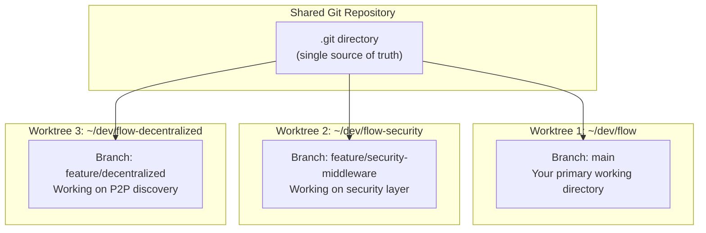
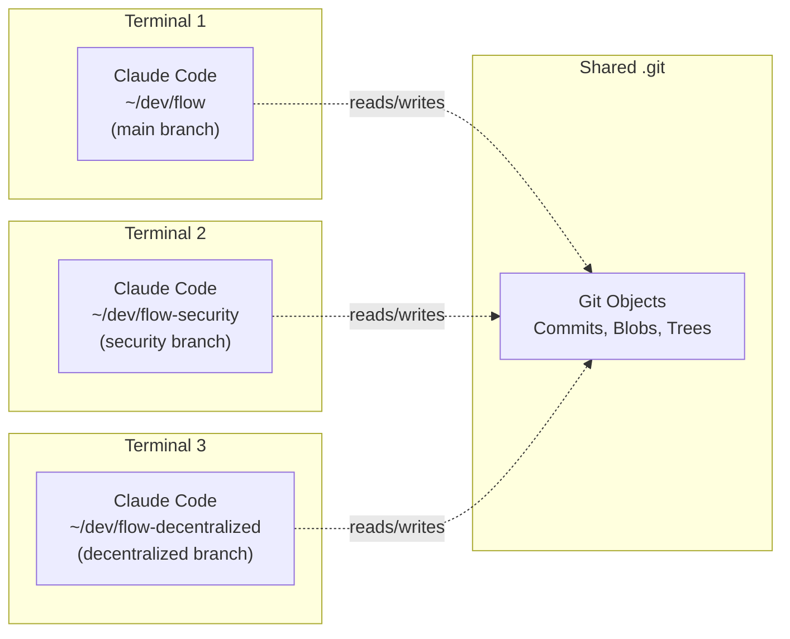
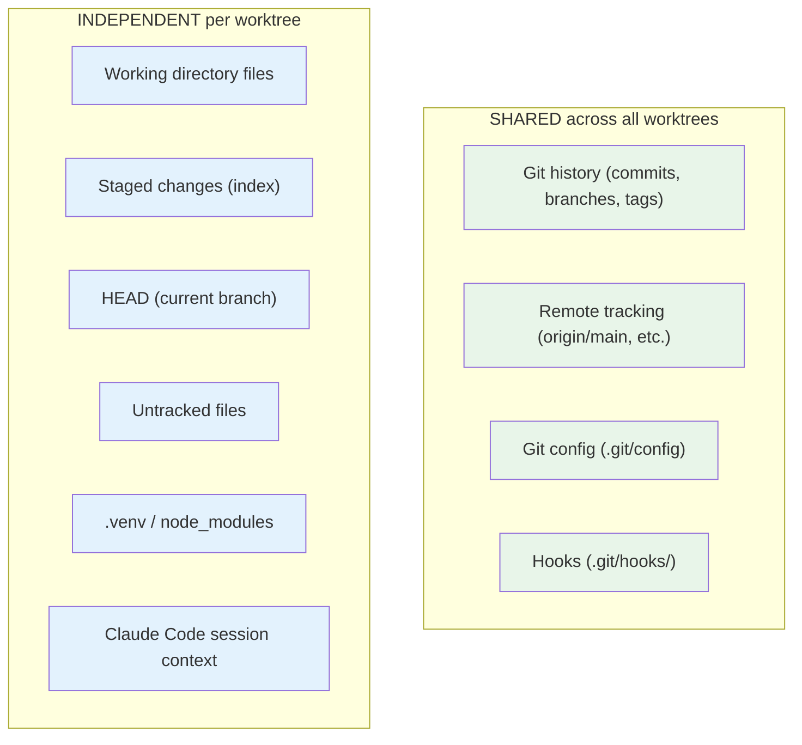
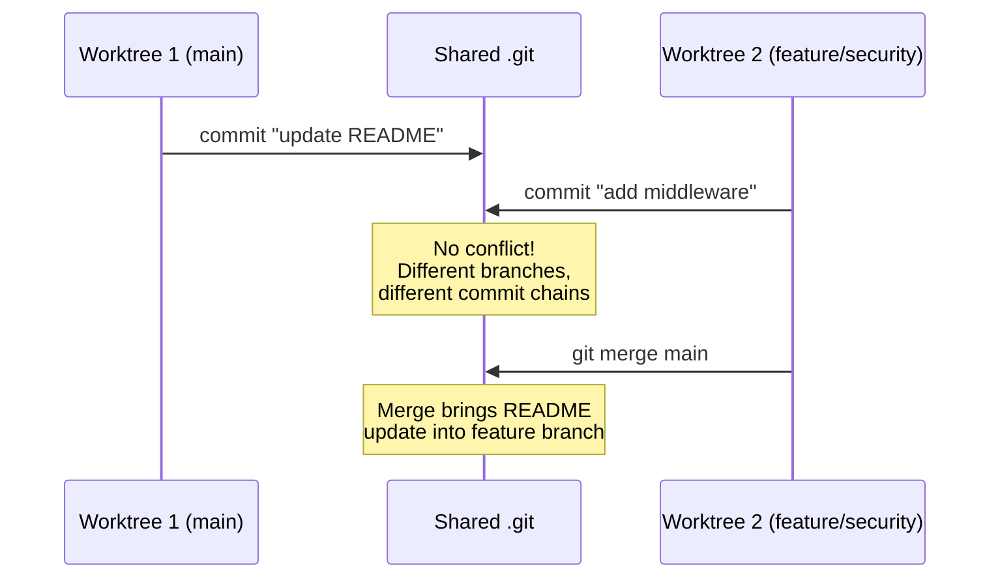
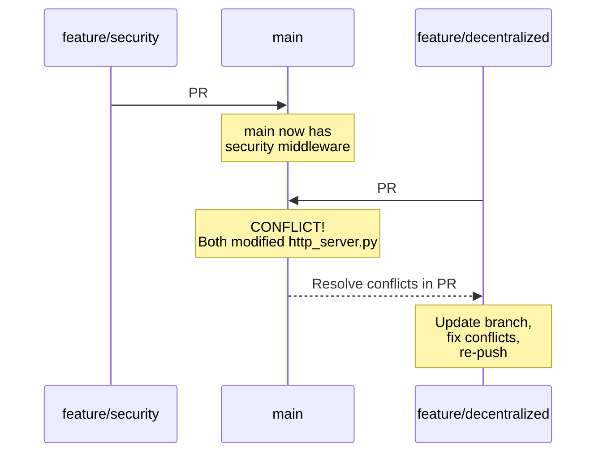
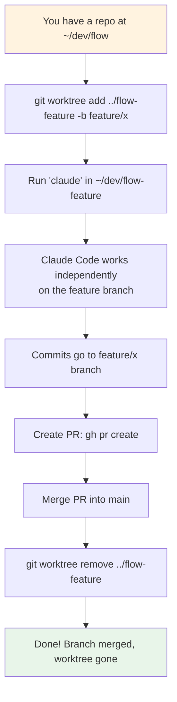

# Git Worktrees with Claude Code

## What Is a Git Worktree?

A git worktree lets you check out multiple branches of the same repository
into different directories — simultaneously. Each directory has its own
working tree, but they all share the same `.git` history.



## Why Use Worktrees?

Without worktrees, switching branches means:
- Stashing or committing unfinished work
- Waiting for `node_modules` / `.venv` to rebuild
- Losing your mental context
- One Claude Code session blocks another

With worktrees:
- Each branch lives in its own folder
- No stashing, no rebuilding
- Run Claude Code in each folder independently
- Work on multiple features in parallel

## How to Create a Worktree

```bash
# You're in ~/dev/flow on the main branch

# Create a worktree for a new branch
git worktree add ../flow-security -b feature/security-middleware

# Create a worktree for an existing branch
git worktree add ../flow-hotfix bugfix/fix-auth

# List all worktrees
git worktree list
# ~/dev/flow                  abc1234 [main]
# ~/dev/flow-security         abc1234 [feature/security-middleware]
# ~/dev/flow-hotfix           def5678 [bugfix/fix-auth]
```

## Running Claude Code in Multiple Worktrees

Each worktree is a separate directory, so you can run a separate Claude Code
session in each one. They are completely independent.



### What's Shared vs. Independent



## How Conflicts Get Resolved

The key question: what happens when two worktrees (and two Claude Code sessions)
modify the same repository?

### Scenario 1: Working on Different Branches (Normal Case)



**No conflict.** Each worktree commits to its own branch. Merging happens
when you're ready, either via `git merge` or a pull request.

### Scenario 2: Both Worktrees on the Same Branch

**Git prevents this.** You cannot have two worktrees checked out to the same
branch. If you try:

```bash
# In ~/dev/flow (on main)
git worktree add ../flow-copy main
# fatal: 'main' is already checked out at '~/dev/flow'
```

This is a safety feature. One branch = one worktree.

### Scenario 3: Merge Conflicts at PR Time



**This is normal git workflow.** Worktrees don't change how merge conflicts
work — they just let you work on both features simultaneously without switching.

### Scenario 4: Rebasing a Worktree

```bash
# In ~/dev/flow-security (feature/security branch)
git fetch origin
git rebase origin/main

# If there are conflicts, resolve them here
# The other worktree (~/dev/flow) is unaffected
```

Each worktree resolves its own conflicts independently.

## Practical Workflow with Claude Code

### Step 1: Set Up Worktrees

```bash
cd ~/dev/flow

# Create worktrees for each feature
git worktree add ../flow-security -b feature/security-middleware
git worktree add ../flow-decentralized -b feature/decentralized-network
```

### Step 2: Run Claude Code in Each

```bash
# Terminal 1
cd ~/dev/flow-security
claude

# Terminal 2
cd ~/dev/flow-decentralized
claude
```

### Step 3: Each Claude Code Session Sees Its Own Branch

- Terminal 1's Claude Code sees `feature/security-middleware` files
- Terminal 2's Claude Code sees `feature/decentralized-network` files
- Neither session interferes with the other
- Both can commit, push, and create PRs independently

### Step 4: Merge When Ready

```bash
# Create PRs from each worktree
cd ~/dev/flow-security
gh pr create --title "Add security middleware"

cd ~/dev/flow-decentralized
gh pr create --title "Add decentralized discovery"

# Merge PR #1 first, then rebase PR #2
```

### Step 5: Clean Up Worktrees

```bash
# After merging, remove the worktree
git worktree remove ../flow-security

# Or force remove if there are untracked files
git worktree remove --force ../flow-security

# Prune stale worktree references
git worktree prune
```

## CLAUDE.md and Worktrees

Each worktree can have its own `CLAUDE.md` file at the root. This is useful for
giving each Claude Code session branch-specific context:

```
~/dev/flow/CLAUDE.md           → "You're on main. Don't break anything."
~/dev/flow-security/CLAUDE.md  → "You're building the security middleware."
~/dev/flow-decentral/CLAUDE.md → "You're building the P2P discovery layer."
```

Claude Code reads `CLAUDE.md` from the working directory, so each session
automatically gets the right context.

## Common Gotchas

### 1. Virtual Environments

Each worktree needs its own `.venv` if you're running Python:

```bash
cd ~/dev/flow-security
python -m venv .venv
source .venv/bin/activate
pip install -r requirements.txt
```

Add `.venv` to `.gitignore` so it's not tracked.

### 2. Ports

If both worktrees try to start services on the same port (e.g., ChromaDB on 8000),
one will fail. Use different ports per worktree or only run services in one.

### 3. Lockfiles

Git operations that modify `.git/` (like `git gc`, `git prune`) affect all
worktrees. Don't run these while another worktree is mid-operation.

### 4. Branch Deletion

You can't delete a branch that has an active worktree. Remove the worktree first:

```bash
git worktree remove ../flow-security
git branch -d feature/security-middleware
```

## Summary



Worktrees + Claude Code = parallel feature development without context switching.
Each Claude Code session lives in its own directory, on its own branch, with its
own context. They share git history but nothing else. Conflicts resolve at merge
time, just like normal git.
