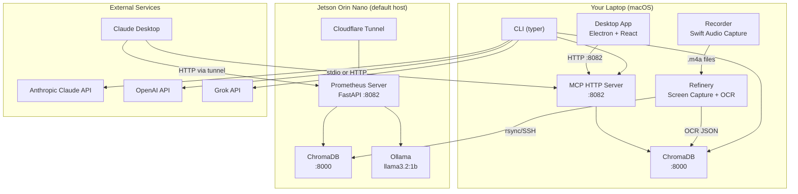
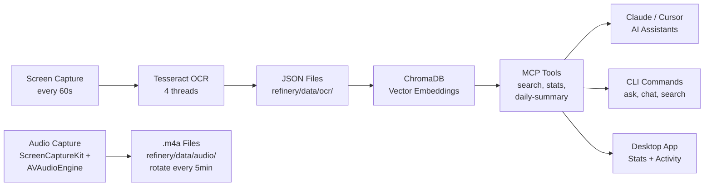
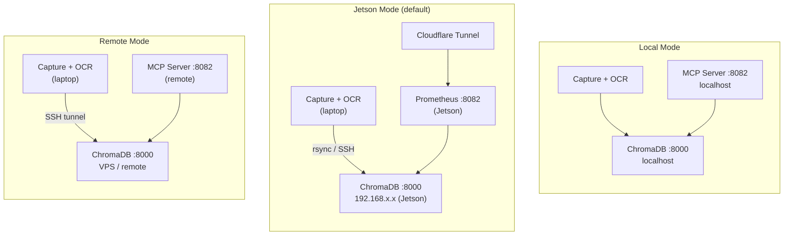
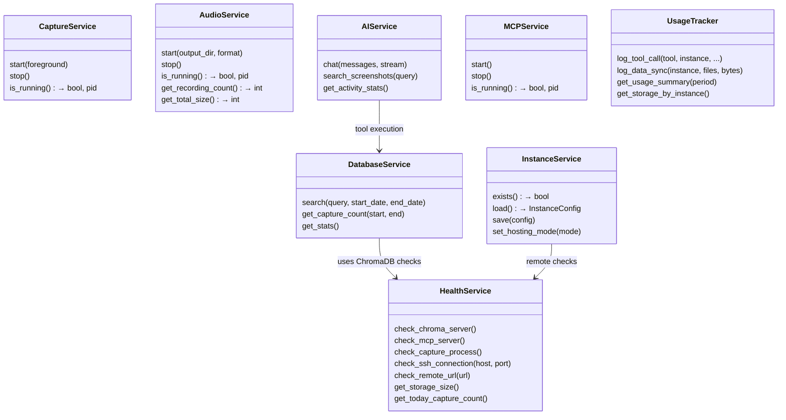
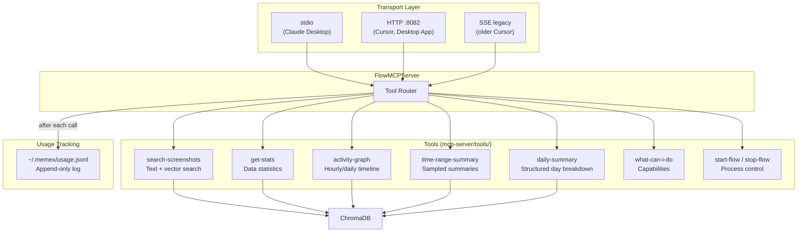
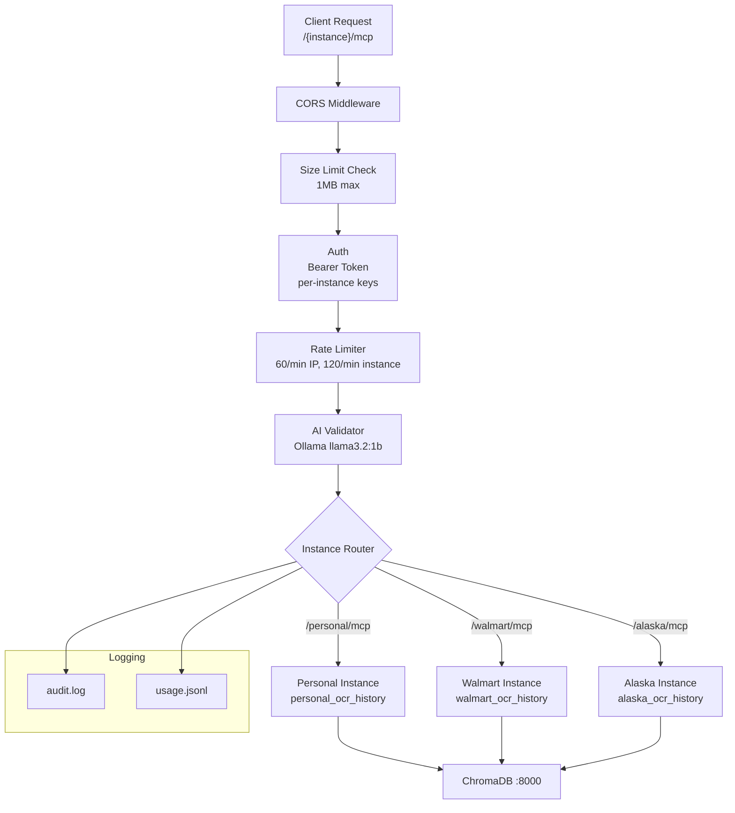
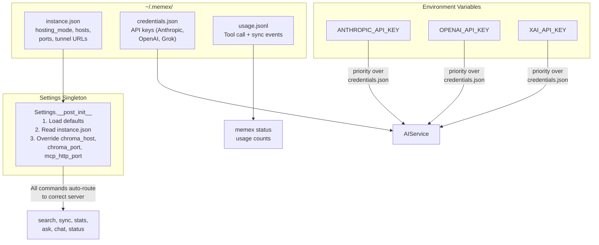

# Memex — Current Architecture

## System Overview



## Data Pipeline



## Hosting Modes



## CLI Command Map

```mermaid
graph LR
    memex["memex"]

    memex --> start["start<br/>First-run setup +<br/>mode-specific startup"]
    memex --> stop["stop"]
    memex --> status["status<br/>Health + hosting mode +<br/>usage counts"]
    memex --> doctor["doctor<br/>Full diagnostics"]

    memex --> chat["chat<br/>Interactive AI chat"]
    memex --> ask["ask<br/>AI search (streaming)"]
    memex --> search["search<br/>Direct text search"]
    memex --> standup["standup<br/>Daily summary"]

    memex --> stats["stats<br/>Activity statistics"]
    memex --> graph["graph<br/>Usage graph"]
    memex --> watch["watch<br/>Live capture view"]
    memex --> sync["sync<br/>Files → ChromaDB"]

    memex --> config["config<br/>set, path"]
    memex --> auth["auth<br/>login, logout, status"]
    memex --> record["record<br/>start, stop, status"]
    memex --> automate["automate<br/>Run markdown automations"]
    memex --> logs["logs"]
```

## Service Layer



## MCP Tool Architecture



## Prometheus Multi-Instance Server (Jetson)



## Configuration & State



## File System Layout

```
flow/
├── cli/                          # CLI application
│   ├── main.py                   # Typer app, all command registration
│   ├── __init__.py               # __version__
│   ├── config/
│   │   ├── settings.py           # Settings dataclass + instance override
│   │   └── credentials.py        # API key storage (~/.memex/credentials.json)
│   ├── commands/
│   │   ├── start.py              # First-run setup + mode dispatch
│   │   ├── stop.py               # Stop daemon
│   │   ├── status.py             # Health + hosting mode + usage
│   │   ├── config.py             # Config view/set (hosting mode switch)
│   │   ├── doctor.py             # Full diagnostics
│   │   ├── search.py             # Direct text search
│   │   ├── ask.py                # AI-powered search (streaming)
│   │   ├── chat.py               # Interactive AI chat
│   │   ├── stats.py              # Activity statistics
│   │   ├── graph.py              # Usage graph
│   │   ├── sync.py               # Files → ChromaDB
│   │   ├── watch.py              # Live capture view
│   │   ├── standup.py            # Daily standup summary
│   │   ├── auth.py               # API key management
│   │   ├── record.py             # Audio recording control
│   │   ├── automate.py           # Markdown automations
│   │   ├── logs.py               # Service log viewer
│   │   ├── contact.py            # Contact info
│   │   └── help_cmd.py           # Extended help
│   ├── services/
│   │   ├── capture.py            # Screen capture process management
│   │   ├── database.py           # ChromaDB search + file-based fallback
│   │   ├── health.py             # Dependency/service/permission checks
│   │   ├── ai.py                 # Multi-provider AI (Claude, GPT, Grok)
│   │   ├── mcp.py                # MCP server process management
│   │   ├── audio.py              # Audio recording management
│   │   ├── chroma.py             # ChromaDB command detection
│   │   ├── instance.py           # Hosting mode config (local/jetson/remote)
│   │   └── usage.py              # Usage tracking (JSONL metering)
│   └── display/
│       ├── components.py         # Rich UI components
│       └── colors.py             # Color palette
│
├── refinery/                     # Capture + OCR pipeline
│   ├── run.py                    # FlowRunner — main capture loop
│   ├── lib/
│   │   ├── screen_detection.py   # Multi-display detection (Quartz)
│   │   └── chroma_client.py      # ChromaDB client wrapper
│   └── data/
│       ├── ocr/                  # {timestamp}_{screen}.json files
│       └── audio/                # {timestamp}_{type}.m4a files
│
├── mcp-server/                   # MCP server (local)
│   ├── server.py                 # FlowMCPServer (stdio transport)
│   ├── http_server.py            # HTTP transport (FastAPI :8082)
│   └── tools/
│       ├── search.py             # search-screenshots
│       ├── stats.py              # get-stats
│       ├── activity.py           # activity-graph, time-range-summary
│       ├── daily_summary.py      # daily-summary
│       ├── system.py             # what-can-i-do, start/stop-flow
│       ├── sampling.py           # Time window sampling
│       ├── vector_search.py      # Semantic vector search
│       └── recent_search.py      # Relevance + recency scoring
│
├── prometheus/                   # Multi-instance server (Jetson)
│   └── server/
│       ├── prometheus_server.py  # FastAPI, path-based routing
│       ├── instance_manager.py   # MemexInstance management
│       ├── auth.py               # Bearer token auth
│       ├── rate_limiter.py       # Per-IP/instance rate limiting
│       └── ai_validator.py       # Ollama-based request validation
│
├── desktop/                      # Desktop dashboard
│   ├── electron/
│   │   ├── main.ts               # Electron main process
│   │   ├── preload.js            # Context bridge
│   │   └── tray.ts               # System tray
│   └── src/
│       ├── App.tsx               # React router
│       ├── pages/                # Stats, Activity, Chat
│       ├── components/           # Sidebar, UI widgets
│       └── api/                  # HTTP client → :8082
│
├── recorder/                     # Audio capture (Swift, macOS)
│   ├── Sources/MemexRecorder/
│   │   ├── main.swift            # Entry point, arg parsing
│   │   ├── AudioCaptureManager.swift
│   │   ├── SystemAudioCapture.swift   # ScreenCaptureKit
│   │   ├── MicrophoneCapture.swift    # AVAudioEngine
│   │   └── AudioFileWriter.swift      # M4A/WAV output + rotation
│   └── Package.swift
│
├── docs/                         # Documentation
└── logs/                         # Service logs
```

## Key Dependencies

| Component | Dependency | Purpose |
|-----------|-----------|---------|
| Refinery | Tesseract | OCR text extraction |
| Refinery | Pillow, OpenCV | Image processing |
| All | ChromaDB | Vector database + embeddings |
| CLI | Typer + Rich | Terminal UI |
| CLI | anthropic, openai | AI provider SDKs |
| MCP Server | mcp SDK | Model Context Protocol |
| MCP Server | FastAPI + uvicorn | HTTP transport |
| Prometheus | Ollama (llama3.2:1b) | Request validation |
| Prometheus | Cloudflare Tunnel | Public HTTPS access |
| Desktop | Electron + React | Desktop GUI |
| Recorder | ScreenCaptureKit | System audio capture |
| Recorder | AVAudioEngine | Microphone capture |

## Usage Tracking Schema

Every MCP tool call is logged to `~/.memex/usage.jsonl` (local) or `logs/usage.jsonl` (Prometheus):

```jsonl
{"ts":"2026-02-12T10:00:00","event":"tool_call","instance":"personal","tool":"search-screenshots","query_len":42,"results":5,"duration_ms":340}
{"ts":"2026-02-12T10:00:01","event":"tool_call","instance":"personal","tool":"daily-summary","query_len":0,"results":1,"duration_ms":120}
{"ts":"2026-02-12T10:05:00","event":"data_sync","instance":"personal","files":60,"bytes":245760}
```

This is metering-only (no billing logic). Foundation for future subscription and usage-based pricing.
