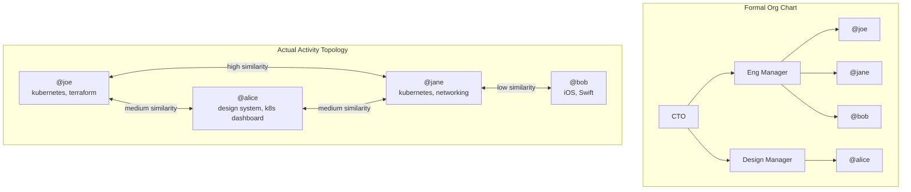

# Team Memex: From Individual to Organization

## The Shift

Memex today is a single-player tool: one person, one machine, one ChromaDB, one
MCP endpoint. To make it useful for teams and orgs, we need to solve:

1. **Discovery** — how does an AI agent find the right person's Memex to query?
2. **Targeting** — how do we avoid searching 500 MCPs when we only need 12?
3. **Topology** — how do we visualize who's actually working with whom?
4. **Ontology** — what are orgs and teams, and how do they relate to Memex nodes?

## New Concepts

### Current Model (Individual)

```
Person → Memex → ChromaDB → MCP Server → NGROK URL
```

### New Model (Organization)

```
Org
├── Team: Engineering
│   ├── Person A → MCP: https://a.memex.dev
│   ├── Person B → MCP: https://b.memex.dev
│   └── Person C → MCP: https://c.memex.dev
├── Team: Design
│   ├── Person D → MCP: https://d.memex.dev
│   └── Person E → MCP: https://e.memex.dev
├── Team: Product
│   └── Person F → MCP: https://f.memex.dev
└── Org Registry (metadata only)
    ├── Member list + roles
    ├── Team assignments
    ├── MCP endpoint directory
    └── Activity topology (updated daily)
```

Each person still owns their data. The org layer is just a directory of endpoints
and metadata — it never stores anyone's actual Memex content.

## Ontology

### Org

An org is a group of people who have agreed to make their Memex nodes queryable
by each other. It's a trust boundary.

```python
class Org:
    id: str                    # "alaskaair"
    name: str                  # "Alaska Airlines Engineering"
    admin_keys: list[str]      # Public keys of org admins
    created_at: datetime
    teams: list[Team]
    members: list[Member]
    query_policy: QueryPolicy  # Free within org? Rate limits?
```

### Team

A team is a subset of an org with a shared function. Teams are the primary
targeting heuristic — when you want a technical answer, you query the
Engineering team's MCPs, not everyone.

```python
class Team:
    id: str                    # "eng"
    org_id: str                # "alaskaair"
    name: str                  # "Engineering"
    members: list[Member]

    # Auto-generated from vector analysis (no manual tags needed)
    activity_centroid: list[float]  # Weighted average of member centroids
    derived_topics: list[str]       # Extracted from centroid cluster analysis
```

No manual tags. The team's `activity_centroid` is computed from its members'
individual centroids (which are themselves derived from their actual screen
captures). `derived_topics` are human-readable labels extracted by running the
centroid through a topic-labeling step — these exist for display only, not
for search.

### Member

A member is a person in an org who runs their own Memex.

```python
class Member:
    handle: str                # "@joe"
    org_id: str                # "alaskaair"
    teams: list[str]           # ["eng", "platform"]
    mcp_endpoint: str          # "https://joe-memex.ngrok.app"
    public_key: str            # For signed queries
    online: bool
    last_seen: datetime

    # Auto-generated — no manual input needed
    embedding_centroid: list[float]  # Recency-weighted avg of work vectors
    derived_topics: list[str]        # Human-readable labels from centroid
    history_depth: datetime          # How far back their Memex data goes
```

No `role` field, no `tags`. The centroid tells you what someone actually does.
If their captures are full of Figma and design reviews, the system knows
they're a designer without anyone labeling them as one.

## The MCP Targeting Problem

If an org has 200 people and you ask "what's the status of the Kubernetes
migration?", you don't want to fan out to all 200 MCPs. That's slow, expensive,
and most results are irrelevant.

### Approach: Two-Phase Query

```
Phase 1: Route (fast, hits the registry only)
  "What's the status of the Kubernetes migration?"
  → Registry checks: which teams/members match "kubernetes"?
  → Returns: [Team: Engineering, Members: @joe, @jane, @bob]

Phase 2: Query (hits only the matched MCPs)
  → Fan out to @joe, @jane, @bob's MCP endpoints
  → Merge results
  → Return unified answer
```

### How Routing Works

The org registry maintains each member's centroid vector. No manual tags or
keyword rules. Routing is pure vector similarity.

```
Routing (all vector-based, no keyword heuristics):

1. Embed the query → vector V

2. Compare V against all member centroids (fast, in-memory)
   → Ranked list by cosine similarity

3. Apply filters:
   - Online status (skip offline members unless cached)
   - Recency (if query asks about "this week", weight recent centroids)
   - Team scope (if query specifies a team, limit to those members)

4. Top-K members get their MCPs queried directly

5. Explicit targeting overrides everything:
   "Ask @joe about..." → route directly to @joe's MCP
```

No rules like "query mentions design → route to Design team." If someone in
Engineering is doing design work, their centroid reflects that and they'll
show up in design-related queries naturally.

### The Registry as an MCP Itself

The org registry is itself an MCP server. An AI agent (Claude, etc.) connects
to the registry MCP, which exposes tools like:

```
Tools exposed by the Org Registry MCP:

list_teams()
  → Returns all teams with member counts and topic summaries

find_members(query: str)
  → Semantic search over member topics/roles
  → Returns ranked list of members + their MCP endpoints

query_team(team_id: str, query: str)
  → Fans out query to all team members' MCPs
  → Aggregates and returns results

query_member(handle: str, query: str)
  → Queries a specific member's MCP directly

get_org_topology()
  → Returns the activity graph (who's working with whom)

get_standup(team_id: str, date: str)
  → Queries each team member: "what did you work on today?"
  → Returns aggregated team standup
```

So from Claude's perspective, the workflow is:

```
Claude connects to: Org Registry MCP

User: "What's the status of the Kubernetes migration?"

Claude calls: find_members("kubernetes migration")
  → Registry returns: [@joe, @jane, @bob] with MCP endpoints

Claude calls: query_team("eng", "kubernetes migration status")
  → Registry fans out to @joe, @jane, @bob
  → Returns merged results from all three

Claude: "Based on the engineering team's recent work, the Kubernetes
migration is 70% complete. Joe has been working on the control plane,
Jane on the network policies, and Bob on the CI/CD pipeline changes."
```

## The Activity Topology

### What It Is

A graph of who is actually working with whom, derived from vector similarity
of what people are doing — not from the org chart HR drew.



The formal org chart says Alice (Design) has nothing to do with Joe (Engineering).
The activity topology reveals Alice is building a Kubernetes dashboard and is
tightly coupled to Joe's work. This is the real org chart.

### How It's Built

A daily cron job runs against every member's Memex:

```python
# Daily topology update (runs at midnight or configurable time)

async def update_topology(org: Org):
    """Query each member's Memex for recent work, compute pairwise similarity."""

    member_summaries = {}

    # Phase 1: Get each member's recent work summary
    for member in org.members:
        if not member.online:
            continue

        # Query their MCP with a standard "what did you work on" prompt
        summary = await query_mcp(
            member.mcp_endpoint,
            "Summarize the main topics and projects from the last 24 hours. "
            "Return as a list of keywords and short descriptions."
        )

        # Embed the summary
        embedding = await embed(summary)
        member_summaries[member.handle] = {
            "summary": summary,
            "embedding": embedding,
            "topics": extract_topics(summary),
        }

    # Phase 2: Compute pairwise similarity
    edges = []
    handles = list(member_summaries.keys())

    for i, h1 in enumerate(handles):
        for h2 in handles[i+1:]:
            sim = cosine_similarity(
                member_summaries[h1]["embedding"],
                member_summaries[h2]["embedding"]
            )
            if sim > 0.3:  # Threshold for "meaningfully related"
                edges.append({
                    "source": h1,
                    "target": h2,
                    "weight": sim,
                    "shared_topics": set(member_summaries[h1]["topics"])
                                   & set(member_summaries[h2]["topics"]),
                })

    # Phase 3: Update the registry
    org.topology = {
        "date": today(),
        "nodes": member_summaries,
        "edges": edges,
    }

    # Phase 4: Update each member's centroid and topics
    for handle, data in member_summaries.items():
        member = org.get_member(handle)
        member.embedding_centroid = data["embedding"]
        member.recent_topics = data["topics"]
```

### What You Can Do With the Topology

**1. Dynamic Org Chart**
Visualize who is actually working together, updated daily. Edges weighted by
vector similarity. Clusters emerge naturally — the "real teams" vs the formal
teams.

**2. Find Experts**
"Who knows about Terraform?" → Don't check LinkedIn endorsements. Check whose
recent Memex activity has the highest similarity to "Terraform".

**3. Spot Silos**
If two teams have zero edges between them, they're siloed. If a single person
is the only bridge between two clusters, they're a bottleneck.

**4. Standup Automation**
Query each team member's Memex for yesterday's work. Generate a team standup
summary automatically. No more "what did you do yesterday?" meetings.

**5. Cross-Pollination Alerts**
"@alice in Design and @joe in Engineering are both working on Kubernetes
dashboards this week. They might want to talk."

## Query Flow: End to End

```
┌──────────────────────────────────────────────────────────┐
│                    AI Agent (Claude)                       │
│                                                           │
│  User: "What's the eng team working on this sprint?"      │
└────────────────────────┬─────────────────────────────────┘
                         │
                         ▼
┌──────────────────────────────────────────────────────────┐
│              Org Registry MCP Server                      │
│                                                           │
│  1. Authenticate agent (signed request)                   │
│  2. Resolve "eng team" → Team: Engineering                │
│  3. Get online members: [@joe, @jane, @bob]               │
│  4. Fan out query to each member's MCP                    │
└────┬──────────────────┬──────────────────┬───────────────┘
     │                  │                  │
     ▼                  ▼                  ▼
┌──────────┐     ┌──────────┐      ┌──────────┐
│ @joe MCP │     │ @jane MCP│      │ @bob MCP │
│          │     │          │      │          │
│ Guard ✓  │     │ Guard ✓  │      │ Guard ✓  │
│ ChromaDB │     │ ChromaDB │      │ ChromaDB │
│ search   │     │ search   │      │ search   │
│          │     │          │      │          │
│ Result A │     │ Result B │      │ Result C │
└────┬─────┘     └────┬─────┘      └────┬─────┘
     │                │                  │
     ▼                ▼                  ▼
┌──────────────────────────────────────────────────────────┐
│              Org Registry MCP Server                      │
│                                                           │
│  5. Collect results from all three                        │
│  6. Merge and summarize                                   │
│  7. Return to AI agent                                    │
└────────────────────────┬─────────────────────────────────┘
                         │
                         ▼
┌──────────────────────────────────────────────────────────┐
│  Claude: "This sprint, Joe is migrating the control      │
│  plane to k8s 1.29, Jane is rewriting network policies   │
│  for the new cluster, and Bob is updating the CI/CD      │
│  pipeline to support multi-arch builds."                  │
└──────────────────────────────────────────────────────────┘
```

## Access Control

### Who Can Query Whom

```
Same team:     Always free, always allowed
Same org:      Free by default, configurable per-member
Cross-org:     Requires explicit opt-in, optional micro-fee
Public:        Only if member has opted in to public discovery
```

### Org Admin Controls

```python
class QueryPolicy:
    intra_team: str = "allow"       # Team members query each other freely
    intra_org: str = "allow"        # Org members query each other freely
    cross_org: str = "deny"         # External queries blocked by default
    public_discovery: bool = False  # Not listed in public registry

    # Per-member overrides
    member_overrides: dict = {}     # {"@joe": {"cross_org": "allow"}}

    # Rate limits
    max_queries_per_day: int = 100  # Per querier, per target

    # Micro-fees (see does-this-run-on-ethereum.md)
    cross_org_fee: float = 0.0     # USDC per query, 0 = free
```

### Identity: Each MCP is a Unique Endpoint

Every person's MCP has a unique URL and public key:

```
@joe  → https://joe-memex.ngrok.app   → pubkey: 0x1a2b...
@jane → https://jane-memex.ngrok.app  → pubkey: 0x3c4d...
@bob  → https://bob-memex.ngrok.app   → pubkey: 0x5e6f...
```

The org registry maps handles to endpoints. When an AI agent wants to query
someone, it:

1. Looks up the handle in the registry → gets MCP endpoint
2. Signs the query with the agent's key (or the querier's key)
3. Sends the signed query to the target MCP
4. Target MCP verifies the signature, checks org membership, processes query
5. Returns signed response

## Implementation Plan

### Phase 1: Org Registry (Minimal)

Build a simple registry that knows about orgs, teams, and member endpoints.

```
New CLI commands:
  memex org create "Alaska Engineering"
  memex org invite @jane --team eng
  memex org join <invite-code>
  memex org members
  memex org query eng "what's everyone working on?"

New MCP tools (exposed by registry):
  list_teams()
  find_members(query)
  query_team(team_id, query)
  query_member(handle, query)

Registry service:
  FastAPI + SQLite
  Stores: orgs, teams, members, endpoints
  Does NOT store: any Memex data
```

### Phase 2: Topology Engine

Add the daily analysis job that computes pairwise similarity.

```
New CLI commands:
  memex org topology          # Show current activity graph
  memex org topology --viz    # Open browser visualization
  memex org experts "kubernetes"  # Who's working on this?

New MCP tools:
  get_org_topology()
  find_experts(topic)
  get_bridges()              # People connecting otherwise-siloed groups

Cron job:
  Runs daily (configurable)
  Queries each online member's MCP for recent work summary
  Computes embeddings + pairwise cosine similarity
  Stores topology in registry DB
```

### Phase 3: Visualization

A web UI that renders the activity topology.

```
Features:
  - Force-directed graph of members
  - Edge thickness = work similarity
  - Node color = team
  - Node size = activity volume
  - Click node → see recent topics
  - Time slider → see how topology changed over weeks
  - Cluster detection → highlight emergent "real teams"
  - Export as SVG/PNG for presentations
```

### Phase 4: Smart Routing

The registry automatically routes queries to the best members.

```
"Who can help with Terraform?"
  → Registry checks member centroids
  → Returns top 3 by similarity: @joe (0.89), @jane (0.72), @bob (0.61)
  → Agent queries them in order until satisfied

"What did the team ship this week?"
  → Registry queries all online team members
  → Aggregates into a weekly summary
  → Deduplicates overlapping work
```

## What Changes for Individual Memex

To support the team model, individual Memex needs a few additions:

```
Existing:
  ✓ Screen capture + OCR
  ✓ ChromaDB vector store
  ✓ MCP server with search tools
  ✓ NGROK tunnel

New:
  + Keypair generation on first run
  + Org membership config (~/.memex/org.json)
  + Signed query/response middleware
  + "Recent work summary" MCP tool (for topology analysis)
  + Org-aware access control in guard model
  + Heartbeat to org registry (not just public registry)
```

The core Memex stays the same. The org layer wraps around it.

## Open Questions

1. **Multi-org membership** — Can a person be in multiple orgs? (Contractors,
   consultants who work with multiple companies.) Probably yes, with separate
   access policies per org.

2. **Org admin visibility** — Can an org admin see all queries to all members?
   Or only aggregate stats? Privacy vs oversight tension.

3. **Offline members** — When someone's laptop is closed, their MCP is down.
   Should the registry cache their last-known topics so they still appear in
   routing? (Probably yes, with a staleness indicator.)

4. **Data residency** — For enterprise orgs, does the registry need to run
   on-prem? (Probably yes — the registry is just FastAPI + SQLite, easy to
   self-host.)

5. **Team auto-detection** — Instead of manually assigning teams, could we
   derive teams from the topology? Cluster detection on the activity graph
   would reveal natural groupings.
