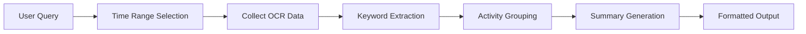
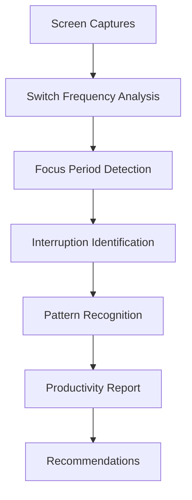
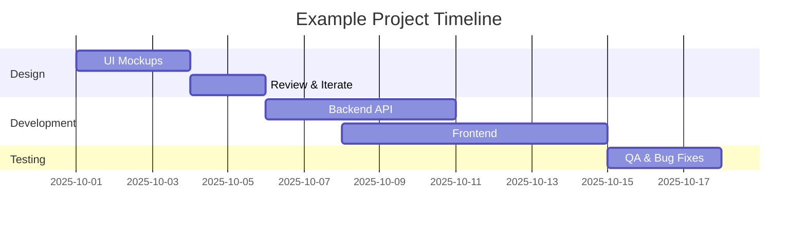

# New Tool Options for Flow MCP Server

## Overview
This document explores potential new tools for the Flow system to enhance productivity tracking, information retrieval, and work context understanding. These tools leverage OCR screenshots and (future) audio transcripts to answer common work scenarios.

## Available Data Types
- **OCR Screenshots**: Text extracted from screen captures, timestamped and screen-labeled
- **Timestamps**: Precise timing information for all captures
- **Screen Information**: Multi-monitor tracking
- **Activity Patterns**: Capture frequency and timing data
- **Future: Audio Transcripts**: Speech-to-text from meetings and conversations

## Tool Ideas

### 1. Daily/Weekly Summary Generator
**Priority: HIGH**

**Description**: Automatically generate daily or weekly summaries of work activity based on screen captures and activity patterns.

**Use Cases**:
- Generate standup notes automatically
- Create weekly progress reports
- Track time spent on different projects
- Identify productivity patterns

**Example Queries**:
- "Generate a summary of what I worked on today"
- "Create a weekly report for last week"
- "What projects did I focus on yesterday?"

**Implementation**:
- Analyze OCR data for project keywords
- Group activities by time blocks
- Identify most-viewed applications and content
- Generate natural language summaries

**Mermaid Diagram**:


---

### 2. Meeting Notes Extractor
**Priority: HIGH**

**Description**: Extract and compile meeting notes from screen captures of video calls, documents, and collaboration tools.

**Use Cases**:
- Recover forgotten meeting details
- Find decisions made in past meetings
- Track action items across meetings
- Search meeting content

**Example Queries**:
- "What were the action items from yesterday's standup?"
- "Find the design decisions from last week's review"
- "Show me notes from meetings about the API project"

**Implementation**:
- Detect meeting applications (Zoom, Meet, Teams)
- Extract visible text during meeting times
- Identify names, action items, and decisions
- Compile chronologically

---

### 3. Code Snippet Finder
**Priority: MEDIUM**

**Description**: Search for code snippets viewed or written across different applications and time periods.

**Use Cases**:
- Find that code example you saw last week
- Track code changes and iterations
- Recover lost code snippets
- Find documentation examples

**Example Queries**:
- "Find the Python function I was looking at yesterday"
- "Show me API examples from last week"
- "Find the SQL query I wrote on Monday"

**Implementation**:
- Detect code patterns in OCR text
- Identify programming languages
- Extract complete code blocks
- Support syntax-aware search

---

### 4. Documentation Searcher
**Priority: MEDIUM**

**Description**: Search through documentation, tutorials, and help pages viewed during work sessions.

**Use Cases**:
- Re-find helpful documentation
- Track learning resources
- Build personal knowledge base
- Find setup instructions

**Example Queries**:
- "Find the React documentation I was reading"
- "Show me the setup guide I followed"
- "Where did I see that API documentation?"

**Implementation**:
- Identify documentation sites and patterns
- Extract and index documentation content
- Track documentation URLs when visible
- Support concept-based search

---

### 5. Communication Thread Follower
**Priority: MEDIUM**

**Description**: Track and search through communication threads across Slack, email, and other messaging platforms.

**Use Cases**:
- Follow up on conversations
- Find specific discussions
- Track project communication
- Recover lost thread context

**Example Queries**:
- "Show me the Slack thread about deployment"
- "Find emails about the budget review"
- "What did Sarah say about the deadline?"

**Implementation**:
- Detect messaging applications
- Extract message content and senders
- Group related messages (threads)
- Support sender and keyword search

---

### 6. Focus Time Analyzer
**Priority: LOW**

**Description**: Analyze when you're most productive and identify focus patterns.

**Use Cases**:
- Optimize work schedule
- Identify distraction patterns
- Track deep work periods
- Improve time management

**Example Queries**:
- "When am I most productive?"
- "How much focus time did I have this week?"
- "What interrupts my deep work sessions?"

**Implementation**:
- Analyze screen switching frequency
- Identify prolonged focus on single tasks
- Detect context switches and interruptions
- Generate productivity insights

**Mermaid Diagram**:


---

### 7. Context Switcher
**Priority: LOW**

**Description**: Track and visualize context switches between different tasks and projects.

**Use Cases**:
- Understand task fragmentation
- Reduce context switching
- Track multitasking patterns
- Improve focus

**Example Queries**:
- "How often did I switch contexts today?"
- "Show me my task transitions yesterday"
- "What causes my context switches?"

**Implementation**:
- Detect application changes
- Identify project/task boundaries
- Track switch frequency and duration
- Generate context switch reports

---

### 8. Project Timeline Builder
**Priority: MEDIUM**

**Description**: Automatically build project timelines based on work activity.

**Use Cases**:
- Visualize project progress
- Track milestones
- Create status reports
- Identify bottlenecks

**Example Queries**:
- "Build a timeline for Project X"
- "Show me the evolution of the mobile app"
- "When did we start working on feature Y?"

**Implementation**:
- Detect project-related keywords
- Group activities by project
- Identify major milestones
- Generate visual timelines

**Mermaid Diagram**:


---

### 9. Application Usage Tracker
**Priority: LOW**

**Description**: Track which applications are used most and generate usage statistics.

**Use Cases**:
- Understand tool usage patterns
- Optimize workflow
- Identify unused subscriptions
- Track productivity tools

**Example Queries**:
- "What applications did I use most this week?"
- "How much time in VS Code vs browser?"
- "Am I using Figma more or less?"

**Implementation**:
- Detect active applications
- Track usage duration
- Generate usage statistics
- Create comparative reports

---

### 10. Collaboration Pattern Analyzer
**Priority: MEDIUM**

**Description**: Analyze collaboration patterns with team members across different tools.

**Use Cases**:
- Track team interactions
- Improve communication
- Identify collaboration gaps
- Optimize team workflows

**Example Queries**:
- "How often do I collaborate with John?"
- "What tools do we use for teamwork?"
- "Show me cross-team communication patterns"

**Implementation**:
- Extract participant names from meetings/chats
- Track collaborative tool usage
- Analyze communication frequency
- Generate collaboration reports

---

### 11. Learning Progress Tracker (with Audio)
**Priority: MEDIUM** (Requires audio transcription)

**Description**: Track learning activities including tutorials, courses, and documentation reading.

**Use Cases**:
- Monitor learning progress
- Track course completion
- Review learned concepts
- Plan future learning

**Example Queries**:
- "What courses am I taking?"
- "Show me my Python learning progress"
- "What tutorials did I complete this month?"

**Implementation**:
- Detect educational content
- Track video tutorials (with audio)
- Monitor course progress
- Generate learning reports

---

### 12. Decision Log Generator
**Priority: HIGH**

**Description**: Automatically log important decisions made during work sessions.

**Use Cases**:
- Track architectural decisions
- Record design choices
- Maintain decision history
- Review past decisions

**Example Queries**:
- "What decisions did we make about the database?"
- "Show me architecture decisions from last month"
- "Why did we choose React over Vue?"

**Implementation**:
- Detect decision-making language patterns
- Extract decision context
- Link decisions to projects
- Generate decision logs

---

### 13. Standup Update Automation
**Priority: HIGH**

**Description**: Automatically generate standup updates based on recent activity.

**Use Cases**:
- Prepare for daily standups
- Generate status updates
- Track completed tasks
- Identify blockers

**Example Queries**:
- "Generate my standup update for today"
- "What did I accomplish yesterday?"
- "Create a status report for the team"

**Implementation**:
- Analyze yesterday's activities
- Extract completed tasks
- Identify ongoing work
- Format as standup notes

**Response Pattern**:
```
Yesterday:
- Completed API endpoint for user authentication
- Reviewed pull requests for mobile team
- Fixed bug in payment processing

Today:
- Deploy authentication changes
- Start work on profile management
- Team meeting at 2pm

Blockers:
- Waiting for design feedback on settings page
```

---

### 14. Reference Link Collector
**Priority: MEDIUM**

**Description**: Collect and organize reference links viewed during research or work.

**Use Cases**:
- Save research references
- Build resource libraries
- Track helpful links
- Share references with team

**Example Queries**:
- "Show me all the React docs I visited"
- "Collect links from my API research"
- "Find that GitHub repo I was looking at"

**Implementation**:
- Extract visible URLs from screenshots
- Categorize by topic/domain
- Track frequency of visits
- Generate link collections

---

### 15. Bug Investigation Tracker
**Priority: MEDIUM**

**Description**: Track bug investigation activities including stack traces, logs, and debugging steps.

**Use Cases**:
- Document debugging process
- Track bug investigation steps
- Share debugging insights
- Learn from past bug fixes

**Example Queries**:
- "Show me how I fixed the auth bug"
- "What steps did I take to debug the crash?"
- "Find similar bugs I've solved"

**Implementation**:
- Detect error messages and stack traces
- Track debugging tool usage
- Identify solution patterns
- Generate investigation reports

---

## Priority Summary

### HIGH Priority (Implement First)
1. Daily/Weekly Summary Generator
2. Meeting Notes Extractor
3. Decision Log Generator
4. Standup Update Automation

### MEDIUM Priority (Implement Next)
5. Code Snippet Finder
6. Documentation Searcher
7. Communication Thread Follower
8. Project Timeline Builder
9. Collaboration Pattern Analyzer
10. Learning Progress Tracker
11. Reference Link Collector
12. Bug Investigation Tracker

### LOW Priority (Consider Later)
13. Focus Time Analyzer
14. Context Switcher
15. Application Usage Tracker

## Implementation Strategy

### Phase 1: Essential Productivity Tools
- Standup Update Automation
- Daily/Weekly Summary Generator
- Meeting Notes Extractor

### Phase 2: Information Retrieval
- Code Snippet Finder
- Documentation Searcher
- Reference Link Collector

### Phase 3: Team Collaboration
- Communication Thread Follower
- Collaboration Pattern Analyzer
- Decision Log Generator

### Phase 4: Advanced Analytics
- Project Timeline Builder
- Focus Time Analyzer
- Bug Investigation Tracker

## Technical Considerations

### Common Patterns
- **Keyword Detection**: Identify specific terms indicating tool purpose
- **Time-based Filtering**: All tools need time range capabilities  
- **Application Detection**: Recognize different apps and platforms
- **Natural Language Output**: Generate human-readable summaries
- **Context Awareness**: Understand work context and project relationships

### Data Requirements
- **OCR Quality**: High accuracy needed for reliable extraction
- **Timestamp Precision**: Accurate timing for activity correlation
- **Screen Metadata**: Application and window information
- **Audio Data**: Voice transcription for meetings (future)

### Integration Opportunities
- **Calendar Integration**: Correlate with meeting schedules
- **Project Management**: Link to Jira, Asana, etc.
- **Version Control**: Connect with Git commits
- **Communication Tools**: Direct Slack/email integration

## Conclusion

These 15 tool ideas provide a comprehensive suite for enhancing productivity, knowledge management, and team collaboration. The priority ranking helps guide implementation, starting with high-impact tools that address common daily needs (standups, summaries, meetings) before moving to more specialized analytics and tracking tools.

The combination of OCR data and future audio transcription creates a powerful foundation for understanding work patterns and retrieving important information that might otherwise be lost or forgotten.

