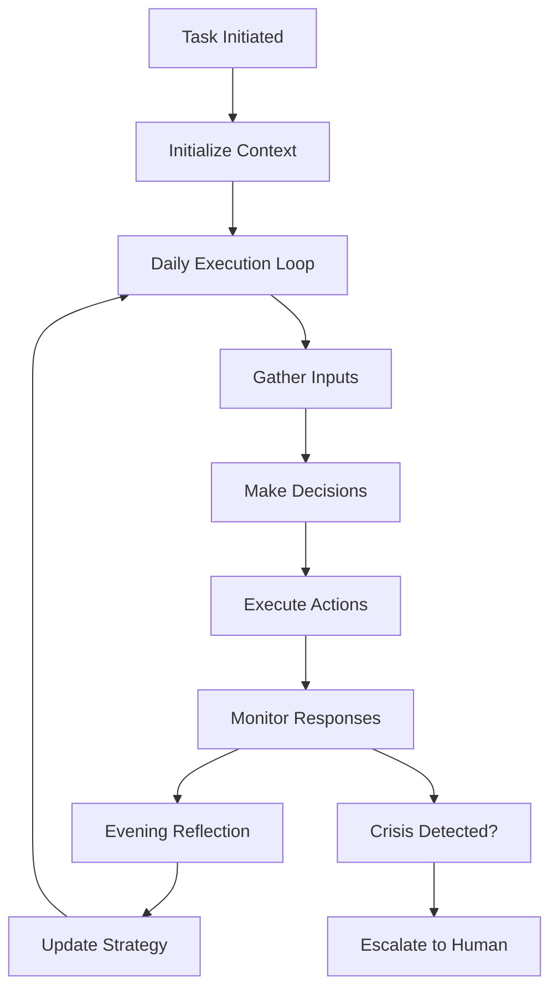

# AI Support Processes: Long-Running Task Management

*Building on the [Human Computer](https://b150dc5a8e25.ngrok-free.app/page/human-computer) concept for spawning and managing extended support tasks*

## Core Concept: The Support Agent Process

A long-running task is like hiring a dedicated assistant for a specific mission. You define the goal, provide the resources, set the parameters, and let it run—learning and adapting over time.

## Example: Supporting Your Brother

Let's walk through how this works with your specific use case:

### Task Definition

```markdown
# Task: Daily Brother Support Campaign

## Mission
Provide consistent, adaptive emotional and motivational support to Scott through daily messages, helping him build better habits and maintain connection with family.

## Duration
Long-running (no end date)

## Success Metrics
- Engagement rate > 70%
- Positive response sentiment > 60%
- Weekly activity completion > 1
- Maintained family connection

## Resources
- Profile data about Scott
- Family input and advice
- Healthcare provider notes
- Historical conversation data

## Constraints
- Maximum 10 messages per day
- Respect therapy boundaries
- No medical advice
- Escalate crisis situations
```

## The Process Lifecycle



### 1. Initialization Phase

```markdown
# process/brother-support/initialization.md

## Context Setup
- Load Scott's profile from `people/scott/profile.md`
- Import communication preferences
- Set up message channels (Email/WhatsApp)
- Initialize learning parameters
- Create baseline metrics

## Information Sources Connected
- ✓ Email API for sending
- ✓ Calendar for therapy schedule
- ✓ Family shared folder for advice
- ✓ Health data feed
- ✓ Previous conversation history

## Strategy Selection
Based on profile, starting with:
- Approach: Warm, brotherly, humor-based
- Timing: 9 AM, 2 PM, 8 PM check-ins
- Content: 40% humor, 30% nature, 30% motivation

## Hypotheses to Test
1. Morning messages work better on weekends
2. Nature content increases engagement
3. Family mentions improve response rate
```

### 2. Daily Execution Loop

```markdown
# process/brother-support/daily/2025-10-16.md

## Morning Routine (6:00 AM)
1. Check overnight messages
2. Review yesterday's learnings
3. Gather new inputs
4. Plan today's approach

## Input Ingestion (6:15 AM)
### New Information Available:
- Family advice: "Dad suggests hiking this weekend"
- Health data: Sleep quality 6/10
- Calendar: Therapy at 2 PM
- Weather: Sunny, 72°F

### Context Integration:
- Good weather + Dad's advice = Outdoor activity opportunity
- Therapy day = Supportive, no pressure
- Sleep mediocre = Gentle morning approach

## Today's Plan
- 9:00 AM - Gentle good morning (no pressure)
- 11:30 AM - Pre-therapy encouragement
- 3:30 PM - Post-therapy space (no questions)
- 5:00 PM - Suggest weekend hike (Dad's idea)
- 8:00 PM - Wind-down check-in
```

### 3. Information Ingestion

The system continuously ingests information from multiple sources:

```markdown
# process/inputs/sources.md

## Active Information Feeds

### 1. Markdown Documents (Manual)
**Location:** `inputs/healthcare/`
**Format:** Structured markdown
**Frequency:** After each appointment
**Example:**
```
# Therapist Notes - 2025-10-16
## Key Themes
- Working on catastrophizing thoughts
- Sleep hygiene priority
- Encourage outdoor activities

## Suggested Interventions
- Gentle reality testing
- Evening routine reminders
- Nature-based behavioral activation
```

### 2. Family Input
**Location:** `inputs/family/`
**Format:** Informal notes
**Processing:** Extract actionable suggestions
```
Mom says: "Scott seemed happy after choir practice. 
Maybe mention music more?"
→ Action: Increase music-related content
```

### 3. Response Analytics
**Automatic Processing:**
- Response time (how quickly he replies)
- Message length (engagement level)
- Sentiment analysis (mood indicators)
- Keywords (interests, concerns)

### 4. External Data
- Weather (for outdoor suggestions)
- Calendar (respect boundaries)
- News/Events (relevant topics)
```

### 4. Learning & Adaptation

```markdown
# process/brother-support/learning/week-42.md

## Weekly Learning Summary

### What Worked ✅
- Afternoon messages (2-4 PM): 85% response rate
- Dad attribution: Positive reception
- Nature memes: Highest engagement
- Post-therapy space: Appreciated

### What Didn't Work ❌
- Morning messages before 9 AM: Often ignored
- Multiple behavioral suggestions: Overwhelming
- Generic motivation quotes: No engagement

### Pattern Recognition
- Energy follows predictable daily curve
- Therapy days need lighter touch
- Weekend receptiveness 40% higher
- Humor breaks tension effectively

### Strategy Adjustments for Next Week
1. Shift 70% of messages to 2-4 PM window
2. Limit behavioral prompts to 1/day
3. Increase nature content to 50%
4. Add music references per Mom's observation

### New Hypotheses to Test
- "Music mentions on choir days increase positivity"
- "Saturday morning is optimal for activity planning"
- "Shared family memories improve connection"
```

### 5. Decision Transparency

Every decision is logged with reasoning:

```markdown
# decisions/2025-10-16/14-30-meme-selection.md

## Decision Point: 2:30 PM Message

### Context
- Time: Post-therapy (ended at 2 PM)
- Last response: None (therapy)
- Mood indicator: Unknown (in therapy)
- Energy level: Assumed moderate

### Options Considered
1. **Skip message** - Give more space
   - Pro: Respect therapy processing
   - Con: Miss connection opportunity
   
2. **Send light meme** - Gentle touch
   - Pro: Non-intrusive, supportive
   - Con: Might seem dismissive
   
3. **Send "thinking of you"** - Direct support
   - Pro: Shows care
   - Con: Might feel pressured

### Decision: Option 2 (Light meme)
**Reasoning:** 
- History shows appreciation for post-therapy lightness
- Meme allows engagement without obligation
- Can gauge mood from response

### Execution
- Selected: Nature meme with calm vibe
- Message: "thought you'd like this 🌲"
- Sent: 2:31 PM

### Result
- Read: 2:33 PM ✓
- Response: "nice, thanks" (2:45 PM)
- Sentiment: Neutral-positive
- Learning: Approach validated
```

## Process Capabilities

### Multi-Tool Orchestration

The process can coordinate multiple tools:

```python
class SupportProcess:
    def __init__(self, task_definition):
        self.task = task_definition
        self.tools = {
            'messenger': MultiChannelMessenger(),
            'researcher': ContentFinder(),
            'analyzer': SentimentAnalyzer(),
            'scheduler': TaskScheduler(),
            'learner': PatternLearner()
        }
    
    async def daily_execution(self):
        # Morning planning
        context = await self.gather_context()
        plan = await self.create_daily_plan(context)
        
        # Execute throughout day
        for scheduled_action in plan:
            await self.wait_until(scheduled_action.time)
            result = await self.execute_action(scheduled_action)
            await self.process_result(result)
        
        # Evening learning
        await self.reflect_and_learn()
```

### Handling Complex Scenarios

```markdown
# process/scenarios/crisis-detection.md

## Scenario: No Response for 48 Hours

### Detection
- Last response: 2025-10-14 15:30
- Messages sent since: 12
- Read receipts: Yes
- Responses: None

### Escalation Decision Tree
```
Hour 24: Switch to lighter touch
Hour 36: Send "just checking in, no pressure"
Hour 48: Alert family member
Hour 60: Suggest someone visits
Hour 72: Emergency escalation
```

### Executed Actions
1. Notified Joe via priority alert
2. Queued gentle check-in
3. Prepared resource list
4. Documented in `alerts/2025-10-16.md`

### Resolution
- Joe called Scott directly
- Scott was okay, just overwhelmed
- Adjusted approach to fewer messages
- Learned: Sometimes less is more
```

## Implementation Architecture

### File Structure for Process

```
process/
├── brother-support/
│   ├── definition.md           # Task definition
│   ├── initialization.md       # Setup documentation
│   ├── daily/                  # Daily execution logs
│   │   ├── 2025-10-16.md
│   │   └── 2025-10-17.md
│   ├── learning/               # Learning summaries
│   │   ├── daily/
│   │   ├── weekly/
│   │   └── monthly/
│   ├── decisions/              # All decisions made
│   ├── scenarios/              # Handled edge cases
│   └── metrics/                # Performance tracking
├── inputs/
│   ├── healthcare/             # Provider notes
│   ├── family/                 # Family input
│   ├── responses/              # Message responses
│   └── external/               # Weather, news, etc.
└── outputs/
    ├── messages/               # Sent messages
    ├── reports/                # Generated summaries
    └── escalations/            # Human alerts
```

### State Management

```markdown
# process/brother-support/state.md

## Current State: ACTIVE

### Process Vitals
- Running since: 2025-10-01
- Total days: 16
- Status: Healthy
- Last execution: 14:31:22

### Today's Progress
- Messages planned: 10
- Messages sent: 7
- Responses received: 4
- Engagement rate: 57%

### Active Patterns
- Best time: 2-4 PM
- Best content: Nature
- Current mood: Stable
- Energy trend: Improving

### Next Actions
- 5:00 PM - Weekend activity suggestion
- 8:00 PM - Evening wind-down
- Tomorrow: Focus on music content

### Learning Queue
- Test Saturday morning timing
- Try voice message format
- Incorporate choir reference
```

## Benefits of This Approach

### For You (The Initiator)

1. **Set and Forget** - Define the task once, it runs indefinitely
2. **Full Visibility** - See exactly what's happening and why
3. **Easy Adjustments** - Update strategy through markdown edits
4. **Peace of Mind** - Know support is consistent even when you're busy

### For Your Brother (The Recipient)

1. **Consistent Support** - Never forgotten, always remembered
2. **Adaptive Approach** - Learns what works specifically for him
3. **Respectful Boundaries** - Knows when to give space
4. **Family Connection** - Feels the family's care through the system

### For Healthcare Providers

1. **Transparent Integration** - Can see how their advice is applied
2. **Data Insights** - Patterns they might not otherwise see
3. **Continuity** - Support between sessions
4. **Documentation** - Clear record of interventions and responses

## Scaling to Other Processes

This same architecture can handle:

### Elder Care Support
```markdown
# process/mom-care/definition.md
- Daily medication reminders
- Appointment coordination
- Social activity scheduling
- Health monitoring
```

### Child Development Tracking
```markdown
# process/child-development/definition.md
- Milestone documentation
- Activity suggestions
- Learning resource curation
- Progress reporting
```

### Professional Relationship Management
```markdown
# process/network-maintenance/definition.md
- Quarterly check-ins
- Birthday remembrances
- Opportunity sharing
- Connection facilitation
```

## Getting Started

1. **Define Your Task** - Clear mission and success metrics
2. **Set Up Information Flows** - Connect your data sources
3. **Initialize Context** - Load relevant background
4. **Start Small** - Begin with simple daily execution
5. **Learn and Iterate** - Let the system improve over time

## The Power of Transparent AI Processes

Unlike traditional automation:
- Every decision has a reason
- Every action has a record
- Every pattern leads to learning
- Every stakeholder can understand

This isn't about replacing human care—it's about ensuring that care is consistent, thoughtful, and adaptive, even when life gets overwhelming.

The markdown foundation means that at any moment, you can ask "What is happening with my brother's support?" and get a complete, understandable answer—not a black box, but a glass box where every gear is visible and every decision is documented.

---

*Your support process is now ready to begin. The infrastructure is transparent, the learning is continuous, and the care is consistent. All that's needed is your intent and the system handles the execution.*